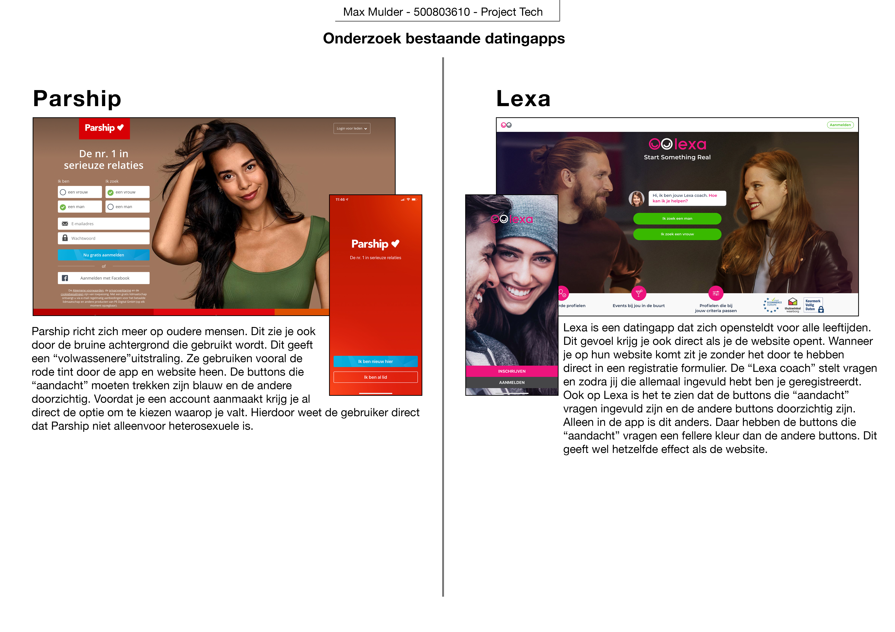

#Onderzoek datingapps
##Max Mulder

Ik heb 4 dating sites onderzocht en gekeken naar hoe hun homepagina eruit ziet en wat daar uit te halen is voor als je nieuw komt op de webpagina. Ook heb ik gekeken naar wat voor kleuren ze gebruiken.
Hieronder mijn onderzoek:

##Conclusie
Iets wat ik vooral terug zag komen in de dating sites was dat ze vooral de kleur roze gebruiken. Ook proberen ze de gebruiker aan te spreken met hun gekozen afbeeldingen. Door hun afbeeldingen zie je heel snel wat hun doelgroep is. Betreft inlog en registratie was het heel interessant om te zien dat je op Lexa door een "lexa coach" door de registratie pagina wordt geholpen. Hierdoor voelt het wat persoonlijker.